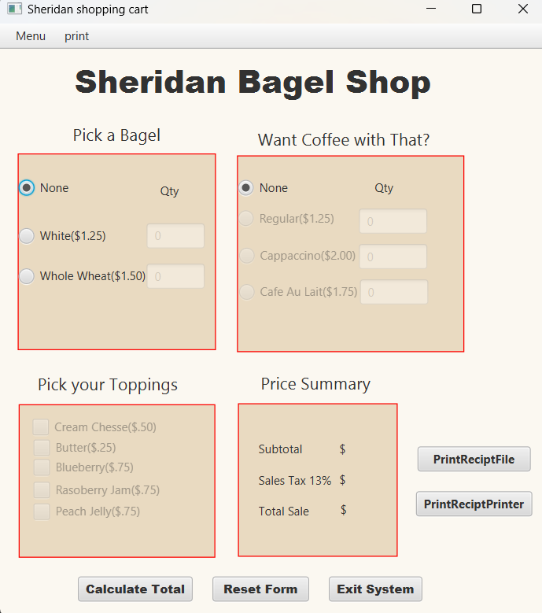

# ShoppingCart

The **ShoppingCart** project is a JavaFX-based application that enables users to browse products, add items to their cart, and manage their shopping experience efficiently. Developed using Visual Studio Code, it demonstrates object-oriented principles in Java and provides a foundation for understanding e-commerce application development.

## Features

- **Product Browsing:** View a list of available products.
- **Add to Cart:** Add selected products to the shopping cart.
- **Remove from Cart:** Remove items from the cart as needed.
- **View Cart:** Display the current contents of the shopping cart.
- **Checkout Process:** Simulate the checkout process to complete the purchase.